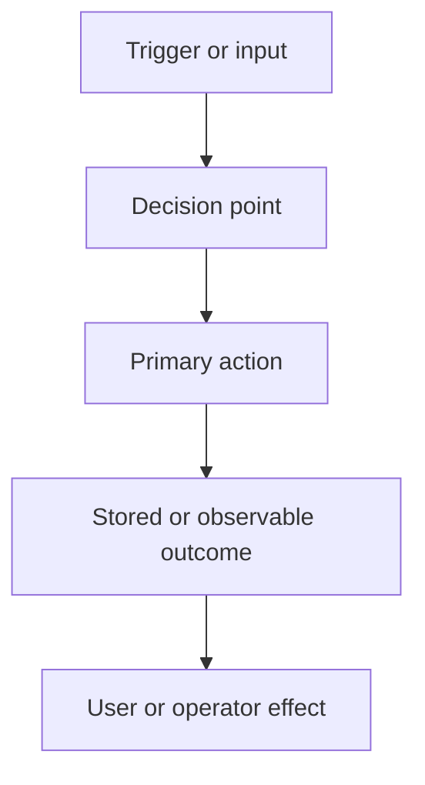

# RFD0000 - <Title>

- Feature Name: `<unique-lowercase-identifier>`
- Status: Draft
- Author: `<name-or-handle>`
- Start Date: `<YYYY-MM-DD>`
- Updated: `<YYYY-MM-DD>`
- Discussion PR: `<link-or-TBD>`
- Tracking Issue: `<link-or-TBD>`

<!--
Adapt this metadata to the repository's established convention. Replace every
placeholder and remove all instructional comments before requesting review.
-->

## Summary

<!-- State the proposal and its intended outcome in one clear paragraph. -->

<One-paragraph explanation of the proposed feature, policy, or system change.>

## Motivation

<!--
Explain the current problem and necessary background. Identify who experiences
it and give concrete use cases. Describe why the current behavior or available
workarounds are insufficient. Do not start with implementation details.
-->

<Why should the project make this change?>

## Goals

- <Outcome this RFD intends to achieve.>

## Non-goals

- <Related outcome intentionally excluded from this RFD.>

## Guide-level explanation

<!--
Teach the proposal as if it already existed. Introduce its mental model and
show realistic examples of how users, operators, or contributors interact with
it. Include API, CLI, migration, or error examples when useful.
-->

<Explain how people should understand and use the proposed design.>

### Example

<Provide at least one end-to-end example when applicable.>

### Diagram

<!-- Remove this section if a diagram adds no value. -->

## Reference-level explanation

<!--
Specify the design deeply enough to evaluate and implement it. Describe
components, boundaries, ownership, data flow, lifecycle, failure behavior,
invariants, and interactions with existing subsystems. Return to the examples
above and explain why they work.
-->

### Architecture and boundaries

<Describe affected components and their responsibilities.>

### Data model and interfaces

<Describe public APIs, schemas, protocols, persistence, or configuration.>

### Lifecycle and failure semantics

<Describe normal flow, edge cases, retries, cancellation, partial failure, and recovery.>

### Invariants

- <Property implementations must preserve.>

### Compatibility and migration

<Describe compatibility impact and migration, or state why none is required.>

### Security, privacy, and observability

<Describe trust boundaries, sensitive data, abuse cases, auditing, metrics, and logs, or state why these are not applicable.>

### Rollout and validation

<Describe sequencing, tests, acceptance criteria, and rollback strategy.>

## Drawbacks

<!-- Be candid about complexity, cost, risk, maintenance, and user impact. -->

- <Reason not to adopt this proposal.>

## Rationale and alternatives

### Proposed design

<Why is this design the best tradeoff for this project?>

### Simpler or narrower approach

<Could a local helper, module, configuration change, or smaller policy solve the problem?>

### Other alternatives considered

- **<Alternative>:** <What it offers and why it was rejected.>

### Do nothing

<What happens if the project keeps the current design?>

## Prior art

<!--
Discuss relevant approaches in this project and elsewhere. Extract useful
lessons; precedent alone is not justification.
-->

<Relevant prior work and what this proposal learns from it.>

## Unresolved questions

### Before acceptance

- <Question that should be resolved through RFD review.>

### During implementation

- <Detail that can safely be resolved while implementing.>

### Out of scope

- <Related issue intentionally deferred to independent future work.>

## Future possibilities

<!-- These ideas are non-binding and do not justify accepting this RFD. -->

<How might this design evolve or interact with the wider system later?>
